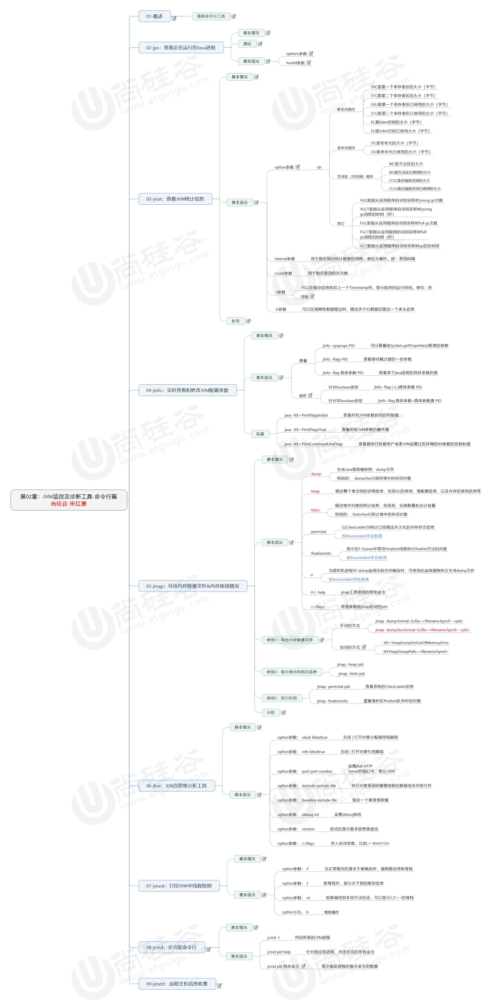

# JVM监控及诊断工具-命令行篇

## 文章思维导图

## 一 概述

​	性能诊断是软件工程师在日常工作中经常要面对和解决的问题，在用户体验至上的今天，解决好应用的i性能问题能带来巨大的收益。

​	Java作为最流行的编程语言之一，其应用性能诊断一直受到业界的广泛关注。可能造成Java应用出现性能问题的因素非常多，比如

- 线程控制

- 磁盘读写

- 数据库访问

- 网络IO

- 垃圾收集

  要想定位这些问题，一款优秀的性能诊断工具必不可少。

## 二 jps （Java Process Status）查看正在与运行的Java进程

### 参数

- -q: 仅显示ID

- -l 输出程序的全限定名

- -m 输出进程启动时传递给main的参数
- -v 列出JVM参数

### 注意：

​	如果Java进程关闭了默认开启的`UserPerfData`参数，则jps无法探测。

## 三 jstat JVM统计信息

- jstat用于监视虚拟机各种运行状态信息，比如类装载，内存，GC，JIT编译等。

- jstat -<option> [-t] [-h<lines>] <vmid> [<interval> [<count>]]

- option

  - -class  显示ClassLoader的相关信息

    
    
  - -gc 显示与GC相关的堆信息

     
     
     后缀C表示容量 后缀U表示已使用 后缀T表示耗时
     
  - -gccapacity: 显示内容与-gc基本相同，但是输出主要关注堆各个区域最大最小空间

     

  - -gcutil :关注已使用占总空间的比例
  - -gcnew 显示新生代的情况
  - -gcold 显示老年代的情况
  - -gccause 与gcutil输出一样，最后多显示最后一次发生GC的原因

  - -compiler: 显示JIT编译器编译过的方法 耗时等

     

  - -printcompilation: 输出已经被JIT编译过的方法

     

- -t 表示在输出信息前加时间戳 表示程序的运行时间 单位 s 

   

-h 表示多少行内容之后输入一次表头信息

- interval 指定更新统计数据的周期，单位ms 每隔n毫秒输入一次

   

count  与上个参数 配合使用 表示一共输出多少次 空表示一直输出

## 四 jinfo 查看和修改JVM配置参数

- jinfo <option> <pid>

- option

  - 查看

    - jinfo -sysprpos pid ：查看该进程的全部配置信息
    - jinfo -flag 参数名 pid： 查看指定参数值

    
    - -flag <具体参数> pid： 查看具体参数的值

  - 修改
    - 布尔类型: jinfo -flag +-参数 pid
    - 非布尔类型: jinfo -flag 参数名=参数值 pid

  

## 五 jmap 导出内存映像文件&内存使用情况

## 六 jhat JDK自带的堆分析工具

## 七 jstack 打印JVM中的线程快照

## 八 jcmd 多功能命令行

## 九 jstatd 远程主机信息收集

