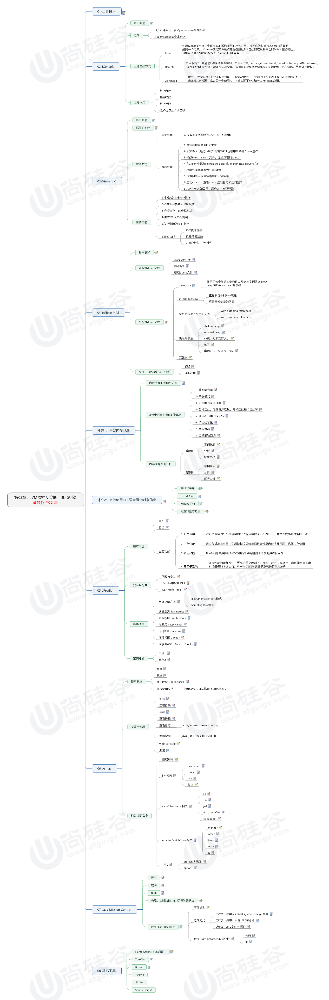

# JVM监控及诊断工具-GUI篇

## 文章思维导图


## 一 .工具概述

#### JDK自带的GUI工具

	- JConsole
	- VisualVM
	- JMC

#### 第三方工具

- MAT

- Jprofiler

- Arthas

- Btrace

  ......

## 二 .JConsole

#### 基本概述

从 Java5开始，JDK自带的Java监控和管理控制台。

#### 启动

cmd jconsole或者在jdk bin目录下执行即可


#### 监控


## 三 .Visual VM

> 一个功能强大的集合-故障诊断和性能监控的可视化工具

#### 启动

cmd jconsole或者在jdk bin目录下执行即可


#### 监控


## 四 . eclipse MAT

> 需要JDK11之后，由于我的JDK版本不支持，此处略

## 五. Jprofiler

> 软件下载地址: [JProfiler11免费版下载](https://www.jb51.net/softs/608640.html#downintro2)
>
> IDEA插件: [下载地址](https://plugins.jetbrains.com/files/253/122553/idea-jprofiler.zip?updateId=122553&pluginId=253&family=INTELLIJ)

### 特点

- 使用方便，界面操作友好

- 对被分析的应用影响小

- CPU，Thread，Memory分析功能强大

- 支持对JDBC，jsp,servlet,socket等分析

- 支持多种模式

- 支持远程JVM

- 跨平台，支持多种系统

  

### 数据采集方式

- Instrumentation重构模式

  在class文件加载之前，将相关的统计功能代码写入到class中，对正在运行的JVM有影响。

  - 优点：调用堆栈信息准确
  - 缺点：如果分析的类较多，则CPU开销较高。此模式配合Filter使用。

- Sampling抽样模式

  一定时间将每个线程栈中方法栈的信息统计出来

  - 优点：对应用影响小
  - 缺点： 一些数据无法提供

## 六. Arthas（阿里巴巴）


>  阿尔萨斯，是Alibaba开源的Java诊断工具，在线排查问题，无需重启，动态跟踪Java代码，实时监控JVM状态。

### [官方地址](https://arthas.aliyun.com/zh-cn/)

## 七. 关于内存泄漏

可达性分析算法来判断对象是否是不再使用的对象，本质是判断一个对象是否还被引用，由于代码的实现不同就会出现很多种内存泄漏问题。

#### 内存泄露的理解

- 严格来说，只有对象不再被程序使用，但是GC又不能回收的情况叫做内存泄露
- 实际上，很多时候一些不好的编程习惯会使得某些对象的生命周期变的很长，比如局部变量定义为类变量，类变量定义为静态变量，此时，可能会导致OOM，这种也可以叫做宽泛意义上的`内存泄露`
- 比如


- 内存泄漏过多，就会导致内存溢出


#### 演示内存泄漏并排查问题

代码

```java
/**
演示内存泄漏
*/
public class Stack {
    private Object[] elements;
    private int size = 0;
    /**
     * 默认容量
     */
    private static final int DEFAULT_INITIAL_CAPACITY = 16;

    public Stack() {
        elements = new Object[DEFAULT_INITIAL_CAPACITY];
    }

    /**
     * 入栈
     */
    public void push(Object e) { //入栈
        ensureCapacity();
        elements[size++] = e;
    }

    /**
     * 出栈
     */
    public Object pop() {
        if (size == 0)
            throw new EmptyStackException();
        Object result = elements[--size];

        //不加此行代码 容易造成内存泄漏
        //elements[size] = null;
        return result;
    }

    /**
     * 扩容
     */
    private void ensureCapacity() {
        if (elements.length == size)
            elements = Arrays.copyOf(elements, 2 * size + 1);
    }
}
```

代码中出栈操作只是将当前位置下移，；出栈的对象并未置Null,此时，指向的对象无法被GC回收

##### 解决方案

在返回出栈对象之前，将该对象置空 即加入 即可

```java
public Object pop() {
        if (size == 0)
            throw new EmptyStackException();
        Object result = elements[--size];
        elements[size] = null;
        return result;
    }
```

