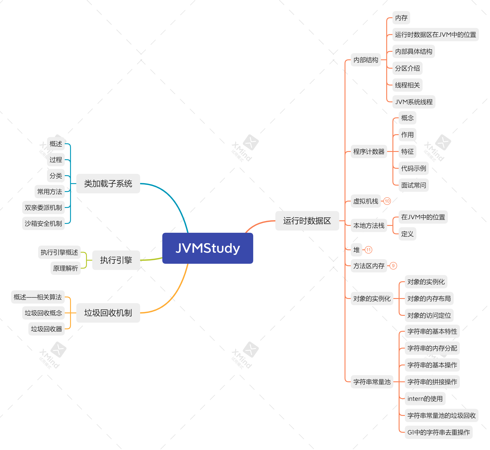

# JVM自学指南

## 一、JVM架构体系

## 二、项目思维导图

## 三、目录

### 1. 类加载子系统

 -	[1-类加载子系统概述](./01-类加载子系统/01-类加载子系统.md)
 -	[2-类加载过程](./01-类加载子系统/02-类加载过程.md)
 -  [3-类加载器分类](./01-类加载子系统/03-类加载器的分类.md)
 -  [4-类加载器的常用方法](./01-类加载子系统/04-类加载器的常用方法.md)
 -  [5-双亲委派机制](./01-类加载子系统/05-双亲委派机制.md)
 -  [6-沙箱安全机制](./01-类加载子系统/06-沙箱安全机制.md)

### 2.  运行时数据区

-	[1-运行时数据区的内部结构](./02-运行时数据区/01-运行时数据区内部结构.md)
-	[2-程序计数器(PC寄存器)](./02-运行时数据区/02-程序计数器(PC寄存器).md)
-	[3-虚拟机栈](./02-运行时数据区/03-虚拟机栈.md)
-	[4-本地方法接口](02-运行时数据区/04-本地方法接口.md)
-	[5-本地方法栈](02-运行时数据区/05-本地方法栈.md)
-	[6-堆](02-运行时数据区/06-堆.md)
-	[7-方法区](02-运行时数据区/07-方法区.md)
-	[8-对象的实例化内存布局与访问定位+直接内存](02-运行时数据区/08-对象的实例化内存布局与访问定位+直接内存.md)
-	[9-字符串常量池](02-运行时数据区/09-字符串常量池.md)

### 3. 执行引擎
- [1-执行引擎]()

### 4. 垃圾回收机制
- [1-概述+常见算法]()
- [2-垃圾回收相关概念]()
- [1-垃圾回收器]()

